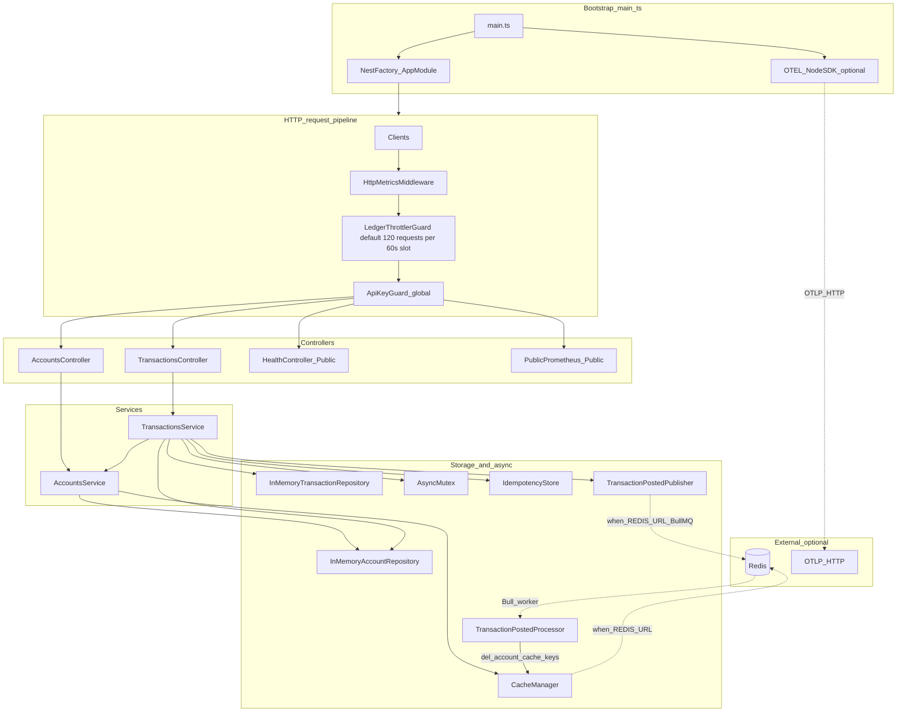
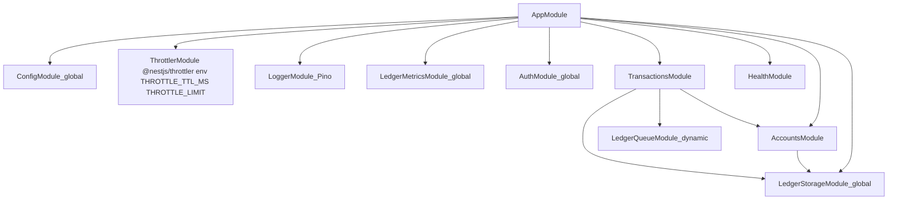

# 📒 Ledger App

A small **double-entry ledger** HTTP API: create accounts, post balanced transactions, and look balances up. Data lives in memory (no database in this repo), but you can turn on **Redis** for account caching and a **BullMQ** queue that runs after each successful post—handy when you want to see how a “real” payments-ish service is shaped without wiring up Postgres on day one.

You also get 🔑 **API keys** on the ledger routes, configurable **HTTP rate limits** (per API key or IP), 📝 **Pino** logs, 📈 **Prometheus** metrics, optional 🔭 **OpenTelemetry** traces, and ❤️ **health** checks.

---

## 🏗️ Architecture

Think of it as one NestJS app with a straight-line request path. `[src/main.ts](src/main.ts)` loads env (including optional `.env`), may start OpenTelemetry if `OTEL_EXPORTER_OTLP_ENDPOINT` is set, then boots `[AppModule](src/app.module.ts)` with Pino and a strict validation pipe.

Incoming HTTP hits **metrics middleware** first, then a **global rate limit** (`[LedgerThrottlerGuard](src/rate-limit/ledger-throttler.guard.ts)`: by default **120** requests per **60 s** sliding window per tracker; see `[throttle-defaults.ts](src/rate-limit/throttle-defaults.ts)`), then a **global API key guard**. Ledger routes need a key; `[@Public()](src/common/public.decorator.ts)` skips auth for `/health` and `/metrics` so local scraping and probes stay simple.

All balances and posted transactions sit in in-memory repositories from `[LedgerStorageModule](src/ledger/ledger-storage.module.ts)`. `[TransactionsService](src/transactions/transactions.service.ts)` wraps each commit in an `[AsyncMutex](src/ledger/async-mutex.ts)` so two commits don’t interleave inside the same process. If you set `REDIS_URL`, account reads can go through a Keyv cache, and after a successful commit a BullMQ job (handled by `[TransactionPostedProcessor](src/queue/transaction-posted.processor.ts)`) logs and clears cached account rows.

### ⚠️ AsyncMutex and production-ready ledgers

Commits are serialized with an in-process `[AsyncMutex](src/ledger/async-mutex.ts)`. That’s a reasonable choice for **one Node process**—it keeps the in-memory math from racing with itself—but it’s not the whole story for a bank-grade system.

**Why that matters**

- 🖥️ **More than one instance** — A mutex doesn’t span processes. Two replicas behind a load balancer can still stomp the same logical accounts unless something else (usually the database) serializes conflicting updates.
- 💥 **Crashes** — Lock state is memory. If the process dies mid-flight, the lock evaporates. Here the data is in-memory too, so you’re already not “durable”; the mutex doesn’t change that.
- 📊 **Heavy contention** — Lots of requests waiting on one lock means more queued promises, more heap churn, and more pressure on the event loop than you’d typically accept in a high-throughput ledger.

**What people tend to ship instead**

- 🗄️ **Real ACID transactions** (Postgres is the usual answer) so every instance talks to one authoritative store.
- 🔗 **Distributed locks** (Redis patterns like Redlock) when you truly need an app-level critical section across machines.
- 🔁 **Durable idempotency** — This API already honors `Idempotency-Key` on `POST /transactions`, but the store is in-memory. In production you’d persist keys and responses so retries are safe across restarts.

### 🔀 Request path and optional infrastructure



Default window length and limit are `[DEFAULT_THROTTLE_TTL_MS` / `DEFAULT_THROTTLE_LIMIT](src/rate-limit/throttle-defaults.ts)` (mapped to env `THROTTLE_TTL_MS` / `THROTTLE_LIMIT`). The guard tracks by **API key** when headers include one, otherwise by **client IP**. `[@SkipThrottle()](https://docs.nestjs.com/security/rate-limiting)` applies to `/health` and `/metrics` so scrapers rarely see **429**.

### 📦 Nest module graph



`[ThrottlerModule](src/app.module.ts)` reads `**THROTTLE_TTL_MS**` (length of each sliding window slot in milliseconds) and `**THROTTLE_LIMIT**` (max requests per tracker per slot); the built-in defaults are defined in `[throttle-defaults.ts](src/rate-limit/throttle-defaults.ts)`.

---

## ✅ Prerequisites

You’ll want **Node 20+** and **npm** (the repo ships a lockfile).

---

## 🚀 Quick start

```bash
npm install
export LEDGER_API_KEYS=dev-key
npm run start:dev
```

By default the app listens on **port 3000**; override with `PORT` if you need something else.

### 📋 Example requests

Below: create two accounts, then post a transaction that debits one and credits the other. Every **ledger** call needs an API key—either `X-API-Key` or `Authorization: Bearer <key>`.

```bash
export API_KEY=dev-key
export BASE=http://localhost:3000

curl -sS -X POST "$BASE/accounts" \
  -H "Content-Type: application/json" \
  -H "X-API-Key: $API_KEY" \
  -d '{"name":"Cash","direction":"debit"}'

curl -sS -X POST "$BASE/accounts" \
  -H "Content-Type: application/json" \
  -H "Authorization: Bearer $API_KEY" \
  -d '{"name":"Revenue","direction":"credit"}'

# Paste the UUIDs from the responses above:
curl -sS -X POST "$BASE/transactions" \
  -H "Content-Type: application/json" \
  -H "X-API-Key: $API_KEY" \
  -H "Idempotency-Key: demo-1" \
  -d '{
    "name": "sample",
    "entries": [
      {"direction":"debit","account_id":"<DEBIT_ACCOUNT_ID>","amount":100},
      {"direction":"credit","account_id":"<CREDIT_ACCOUNT_ID>","amount":100}
    ]
  }'

curl -sS "$BASE/accounts/<DEBIT_ACCOUNT_ID>" -H "X-API-Key: $API_KEY"
```

---

## ⚙️ Environment variables

For a ready-made starting point, copy `[.env.example](.env.example)` to `.env` in the project root and tweak values there. `main.ts` pulls in `dotenv/config`, so a `.env` file “just works” when you run the app locally.


| Variable                      | What it does                                                                                                                                    |
| ----------------------------- | ----------------------------------------------------------------------------------------------------------------------------------------------- |
| `PORT`                        | HTTP port (defaults to **3000**)                                                                                                                |
| `LEDGER_API_KEYS`             | Comma-separated keys allowed to hit `/accounts` and `/transactions`                                                                             |
| `REDIS_URL`                   | When set: Redis-backed cache for `GET /accounts/:id`, plus BullMQ jobs after each successful transaction                                        |
| `ACCOUNT_CACHE_TTL_MS`        | Account cache TTL in ms (default **30000**)                                                                                                     |
| `OTEL_EXPORTER_OTLP_ENDPOINT` | OTLP HTTP base URL (e.g. `http://localhost:4318`); traces post to `{base}/v1/traces` when set                                                   |
| `OTEL_SERVICE_NAME`           | Service name on spans (defaults to `**ledger-app`**)                                                                                            |
| `THROTTLE_TTL_MS`             | Rate limit window in ms (default **60000**). Max `THROTTLE_LIMIT` requests per window **per tracker** (API key when sent, otherwise client IP). |
| `THROTTLE_LIMIT`              | Max requests allowed inside each `THROTTLE_TTL_MS` window (default **120**)                                                                     |


## 🛡️ Rate limiting

`[@nestjs/throttler](https://github.com/nestjs/throttler)` runs globally **before** the API key guard. `/health` and `/metrics` are excluded (`@SkipThrottle`) so probes and Prometheus scrapes do not get **429**s in normal setups. Ledger routes count toward the limit. Storage is **in-memory per process** (multiple replicas each keep their own counters); tighten limits at the gateway or add Redis-backed throttling if you need a shared budget across nodes.

---

## 📮 Redis, cache, and queue (optional)

Redis is **not** required. When it’s off, you still run the same code paths—the cache falls back to in-memory and the “queue” becomes a no-op publisher, which is nice for tests and quick demos.

🐳 When you *do* want Redis:

```bash
docker compose up -d redis
export REDIS_URL=redis://localhost:6379
export LEDGER_API_KEYS=dev-key
npm run start:dev
```

**What changes in practice?** Account reads can come from a read-through cache instead of hitting the repository every time. After a transaction commits, a small BullMQ job carries `{ transactionId, accountIds }` so you can log, invalidate cache keys, or grow toward webhooks and audits without bloating the HTTP handler.

**Why bother for a toy ledger?** Payment and ledger-ish systems often look like this: Redis for hot reads and lightweight work queues, HTTP handlers that return fast, and workers that pick up the slack. This repo lets you flip that on with a single env var.


|                       | Without `REDIS_URL`            | With `REDIS_URL`                        |
| --------------------- | ------------------------------ | --------------------------------------- |
| Account reads         | In-memory cache (per process)  | Shared Redis cache + invalidation       |
| After a commit        | No-op “publisher”              | BullMQ worker (logging + cache deletes) |
| Several app instances | Each process has its own cache | One shared cache + queue                |


---

## 📊 Observability

📝 **Logs** — JSON via `nestjs-pino` (pretty in non-production). Responses echo `x-request-id` (reuse the incoming header if the client sent one; otherwise the app generates one). Deliberately, `Authorization` is not part of the serialized request object in logs.

📈 **Metrics** — `GET /metrics` serves Prometheus text. It’s intentionally public in this demo; lock it down in anything real. HTTP metrics come from middleware, so **401**s from the guard still show up. Path UUIDs are normalized to `:id` in the `route` label to keep cardinality sane. Ledger-specific counters include `ledger_transactions_attempted_total` (after idempotency, one per try) and `ledger_transactions_committed_total` (successful commits only).

Sample `GET /metrics` output after creating accounts and posting a transaction (ledger counters, `http_request_duration_seconds` buckets, `http_requests_total`, `account_operations_total`):

Example Prometheus scrape from 

/metrics

❤️ **Health** — `GET /health` optionally pings Redis when `REDIS_URL` is configured.

🔭 **Tracing** — If `OTEL_EXPORTER_OTLP_ENDPOINT` is set, `main.ts` wires up the OpenTelemetry Node SDK with the OTLP HTTP trace exporter (`{endpoint}/v1/traces`) and common auto-instrumentation. Application code can add spans with `@opentelemetry/api` (for example around transaction commits).

### 📡 Prometheus: latency (P50 / P95 / P99) and status codes

You’ll see a histogram `http_request_duration_seconds` and a counter `http_requests_total`, both labeled with `method`, `route`, and `status`. Percentiles aren’t separate time series—you derive them with `histogram_quantile` in PromQL.

All routes combined:

```promql
histogram_quantile(0.50, sum(rate(http_request_duration_seconds_bucket[5m])) by (le))
histogram_quantile(0.95, sum(rate(http_request_duration_seconds_bucket[5m])) by (le))
histogram_quantile(0.99, sum(rate(http_request_duration_seconds_bucket[5m])) by (le))
```

Example: P99 broken down by normalized route:

```promql
histogram_quantile(0.99, sum(rate(http_request_duration_seconds_bucket[5m])) by (route, le))
```

HTTP status rates:

```promql
sum(rate(http_requests_total[5m])) by (status)
```

🔍 Quick sanity check: `curl -sS localhost:3000/metrics | grep http_`

### 🔎 Viewing traces in Jaeger

1. Start Jaeger (OTLP HTTP on **4318**, UI on **16686**):
  ```bash
   docker compose up -d jaeger
  ```
2. Point the app at the collector and run:
  ```bash
   export OTEL_EXPORTER_OTLP_ENDPOINT=http://localhost:4318
   export OTEL_SERVICE_NAME=ledger-app   # optional; default in code
   export LEDGER_API_KEYS=dev-key
   npm run start:dev
  ```
3. Hit the API with the curl examples above, then open [http://localhost:16686](http://localhost:16686).
4. In Jaeger, pick service `**ledger-app**` (or whatever you set in `OTEL_SERVICE_NAME`), hit **Find Traces**, and open a trace to see the waterfall.

Example trace for `POST /transactions` showing nested `ledger.apply_transaction`:

Jaeger UI: POST /transactions with nested ledger span

If nothing shows up, double-check the env var is set in the **same** shell as `npm run start:dev`, that Jaeger is up (`docker compose ps`), and that you’ve made at least one request after the app booted.

---

## 📋 API behavior (summary)

- `**POST /accounts`** — Create an account. You can pass an optional `id` (UUID), `name`, and `balance` (defaults to 0). `direction` is required (`debit` or `credit`). **201** with the created account.
- `**GET /accounts/:id`** — Fetch one account. **200** if it exists, **404** if not.
- `**POST /transactions`** — Post a balanced set of `entries` (`direction`, `account_id`, `amount`). Debits must equal credits. Unknown account id → **404**; bad input → **400**; success → **201**.
- `**Idempotency-Key`** — Send the same header on retries and you’ll get the same successful body back while the key is remembered (about **30 minutes**, in-memory).

⚖️ **Balance math** — For each entry, the account balance moves by the entry amount when the entry direction matches the account’s natural direction, and in the opposite direction otherwise (classic double-entry bookkeeping on a single line item).

---

## 🧰 Scripts


| Command               | Description                                                        |
| --------------------- | ------------------------------------------------------------------ |
| `npm run start:dev`   | Dev server with watch                                              |
| `npm run build`       | Compile to `dist/`                                                 |
| `npm run build:clean` | Delete `dist/`, then full compile                                  |
| `npm run start:prod`  | Run the compiled app                                               |
| `npm test`            | Jest—`*.spec.ts` files under `[src/](src/)` (see Spec tests below) |
| `npm run lint`        | ESLint                                                             |


---

## 🧪 Spec tests

Unit tests live next to source as `***.spec.ts`**. Jest is configured with `rootDir: src` and matches `*.spec.ts` (`package.json`). Use `**npm run test:watch**` for watch mode and `**npm run test:cov**` for coverage.


| Spec file                                                                                        | What it covers                                                         |
| ------------------------------------------------------------------------------------------------ | ---------------------------------------------------------------------- |
| `[src/ledger/ledger.math.spec.ts](src/ledger/ledger.math.spec.ts)`                               | Balance / double-entry math helpers                                    |
| `[src/transactions/transactions.service.spec.ts](src/transactions/transactions.service.spec.ts)` | Transaction commits against in-memory repos and the mutex              |
| `[src/auth/extract-api-key.spec.ts](src/auth/extract-api-key.spec.ts)`                           | `X-API-Key` and `Bearer` parsing (shared by auth + rate-limit tracker) |


---

